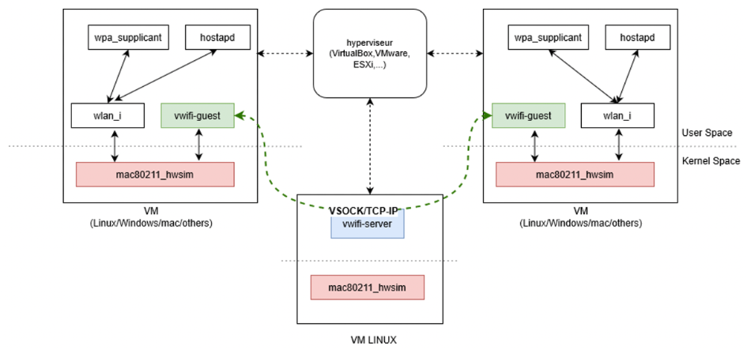
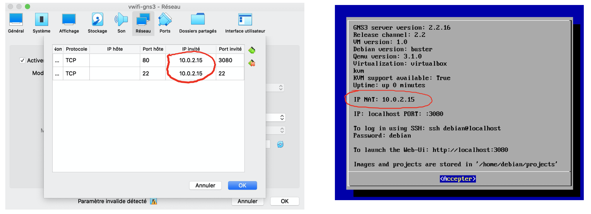

# Cybesecurity E-learning Laboratory

Efrei Paris propose aux étudiants de la majeure cyber-sécurité un environnement de simulation réseau filaire et sans fil basé sur GNS3 et [VWIFI](https://github.com/Raizo62/vwifi). Ce dernier, développé au sein de l’équipe R&D du laboratoire [Alianstic](https://www.efrei.fr/innovation-recherche/le-laboratoire-de-recherche-allianstic/) rattaché à l’école, offre aux élèves une plateforme complète d’entrainement sur différents Labs dédiés au système, au réseau et à la sécurité.

## Architecture de VWIFI


VWIFI est un simulateur  Wi-Fi (802.11) permettant la mise en place de réseaux WI-FI entre machines virtuelles. Il peut être utilisé sous plusieurs Hyperviseurs  (GNS3, QEmu, Virtualbox, VMware, Hyper-V, ...). L'émulation WIFI au niveau de chaque VM s'appuie sur le pilote  `mac80211_hwsim`. 

Le schéma suivant présente l'architecture globale de VWIFI.



## Installation

Il existe plusieurs façons de récupérer et d’utiliser notre plateforme. 

### VM VirtualBox

Avec cette solution, vous n’avez besoin que d’installer VirtualBox sur votre machine. Récupérez ce fichier [OVA](https://efrei365net-my.sharepoint.com/:u:/g/personal/boussad_aitsalem_efrei_net/EQhWl8fPisZHuKiw_rf5bOgBWBdkAWtwzrMutZJKq2rB8A?e=oeAQPi) et importez-le avec un simple clic dans VirtualBox.

Une fois la VM démarrée, ouvrez un navigateur web et connectez-vous à cette URL : [http://localhost](http://localhost).

Pour aller plus vite, visualisez cette [Vidéo](https://efrei365net-my.sharepoint.com/:v:/g/personal/boussad_aitsalem_efrei_net/EZFIeZV2hSJPh5I7sAG4PBsBZGYqoZZQdda4-CC1Uweh6A?e=jUjKVk).



```markdown

#### Remarques

- En cas de problèmes, vérifiez que l’adresse IP NAT sur l’interface de bienvenue de la VM correspond à celle spécifiée dans les paramètres de VirtualBox de la VM.

- Pour partager des fichiers avec la VM, créez un dossier partagé sur votre machine physique et nommer-le `sharedvm`. Procédez par la suite à la configuration de ce dossier sur VirtualBox.

- Vérifiez également que l'imbrication imbriquée est activée sur Virtualbox.
```
